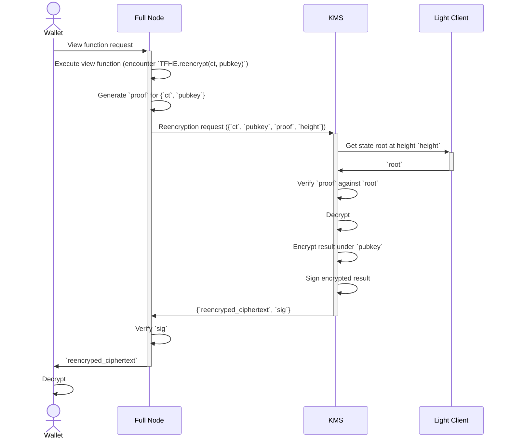

# Key Management System

https://github.com/zama-ai/kms/actions/workflows/publish-docker-image.yml

This repository hosts the code for the Zama Key Management System prototypes.

## MVP Specification

The full KMS specification is currently under review. What follows describes a KMS minimal viable product.

### Description
It is assumed that neither decryptions nor reencryptions happen during transactions. Instead, transactions *mark* ciphertexts as decryptable or reencryptable.
Subsequently, full nodes may issue decryption and reencryption requests to the KMS for ciphertexts which have been marked as decryptable or reencryptable. Usually, this happens upon reception of a request from a user or wallet.

### Sequence Diagram (reencryption)

The process for decryptions is analogous.

For the time being, the light client is assumed to provide valid state roots to the KMS service.

In practice, the light client relies on any full node that is live and up to date with the blockchain.
Once the trusted setup is done at genesis, the light client can be trusted to provide valid state roots for any block, as long as the full node it connects to does not engage in byzantine behavior.

## Implementation

The KMS is iplemented as a gRPC service using the [tonic](https://github.com/hyperium/tonic) crate.
Communication between full nodes and the KMS service is defined by [protobuf](/proto/kms.proto) messages.
The rest of the communication is defined by existing standards and uses JSON-RPC.
For the light client, we currently use CometBFT's [light](https://pkg.go.dev/github.com/cometbft/cometbft/light) package, which provides a service that connects to any CometBFT full node to serve trusted state roots on-demand.
The light client package handles the logic of sequentially verifying block headers.

## Next steps
- [ ] Full Node ->> KMS Reencryption request should contain user signature on `pubkey` and an `ACL` object.
- [ ] KMS should verify the user signature on `pubkey` against the values of permissible decryptors in `ACL`.

## Contribution

See [CONTRIBUTING.md](CONTRIBUTING.md).

